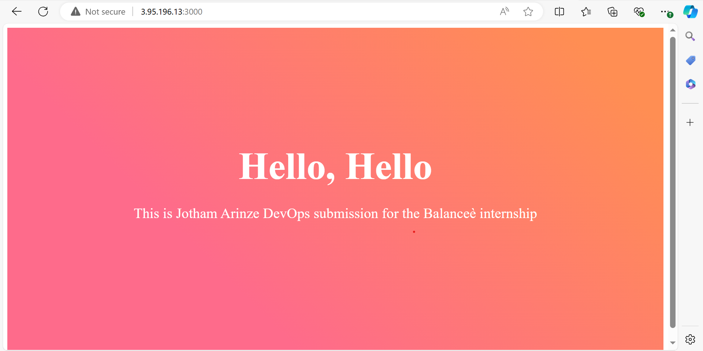

# Balanceè DevOps Internship Submission

This project is a submission for the Balanceè DevOps internship task. It demonstrates a CI/CD pipeline using GitHub Actions, Docker, Docker Compose, and Docker Hub for image storage and deployment.

## Project Structure

```
.
├── .github/
│   └── workflows/
│       └── ci-cd.yml
├── pages/
│   └── index.tsx
├── styles/
│   └── Home.module.css
├── __tests__/
│   └── index.test.tsx
├── .gitignore
├── Dockerfile
├── docker-compose.yml
├── jest.config.js
├── jest.setup.js
├── next.config.js
├── package.json
├── pnpm-lock.yaml
├── README.md
└── tsconfig.json
```

- `.github/workflows/ci-cd.yml`: Contains the GitHub Actions workflow for CI/CD
- `pages/`: Next.js pages directory
- `styles/`: CSS modules for styling
- `__tests__/`: Directory containing test files
- `.gitignore`: Specifies intentionally untracked files to ignore
- `Dockerfile`: Defines how to build the Docker image for the application
- `docker-compose.yml`: Defines the services, networks, and volumes for our Docker application
- `jest.config.js`: Configuration file for Jest testing framework
- `jest.setup.js`: Setup file for Jest
- `next.config.js`: Configuration file for Next.js
- `package.json`: Defines project dependencies and scripts
- `pnpm-lock.yaml`: Lock file for pnpm dependencies
- `tsconfig.json`: TypeScript configuration file

## CI/CD Pipeline

The CI/CD pipeline is configured using GitHub Actions. Here's an overview of the process:

1. **Trigger**: The pipeline is triggered on every push to the `main` branch.
2. **Testing**: The pipeline runs all unit tests.
3. **Build**: If tests pass, a Docker image is built.
4. **Push**: The Docker image is pushed to Docker Hub.
5. **Deploy**: The image is deployed to a staging environment using password-based SSH authentication.

## Local Setup

To set up this project locally:

1. Clone the repository:
   ```
   git clone https://github.com/Jothamcloud/balancee-task.git
   cd balancee-task/
   ```

2. Install dependencies:
   ```
   pnpm install
   ```

3. Run tests:
   ```
   pnpm test
   ```

4. Start the development server:
   ```
   pnpm dev
   ```

   The application will be available at `http://localhost:3000`.

## Docker Setup

### Using Docker

To build and run the Docker image locally:

1. Build the image:
   ```
   docker build -t jothamcloud/balancee-task .
   ```

2. Run the container:
   ```
   docker run -p 3000:3000 jothamcloud/balancee-task
   ```

### Using Docker Compose

To run the application using Docker Compose:

1. Build and start the services:
   ```
   docker-compose up --build
   ```

2. To stop the services:
   ```
   docker-compose down
   ```

The `docker-compose.yml` file defines the services needed for the application. It allows for easy management of multiple containers and simplifies the process of running the application in different environments.

## Deployment

The application is automatically deployed when changes are pushed to the `main` branch and all tests pass. The deployment process uses Docker Hub for image storage and deploys to a staging server using password-based SSH authentication.

To set up the deployment:

1. Create a Docker Hub account if you don't have one.
2. In your GitHub repository settings, go to "Secrets and variables" > "Actions", and add these secrets:
   - `DOCKER_HUB_USERNAME`: Your Docker Hub username
   - `DOCKER_HUB_TOKEN`: A Docker Hub access token
   - `DEPLOY_SERVER`: The IP or hostname of your staging server
   - `DEPLOY_USER`: The username to SSH into your staging server
   - `SSH_PASSWORD`: The password to SSH into your staging server


## Project Setup and Design Choices

## Project Setup and Design Choices

This section explains the setup of the project and the reason behind the choices made.

### 1. Application Framework: Next.js with TypeScript

- **Choice**: Next.js with TypeScript was chosen as the application framework.
- **Reason**: 
  - Next.js provides server-side rendering, which improves initial load time and SEO.
  - TypeScript adds static typing, enhancing code quality and developer productivity.
  - The combination allows for building scalable, type-safe React applications.

### 2. Package Manager: pnpm

- **Choice**: pnpm was selected as the package manager.
- **Reason**:
  - pnpm is faster and more efficient in terms of disk space usage compared to npm or Yarn.
  - It uses a unique approach to managing dependencies, which can significantly reduce installation time and disk space in large projects.

### 3. Containerization: Docker

- **Choice**: Docker was used for containerization.
- **Reason**:
  - Docker ensures consistency across different development and deployment environments.
  - It simplifies the process of packaging the application with all its dependencies.
  - Containers are lightweight and start quickly, which is beneficial for scaling and continuous deployment.

### 4. Container Orchestration: Docker Compose

- **Choice**: Docker Compose was used for defining and running multi-container Docker applications.
- **Reason**:
  - While this project currently has a single service, Docker Compose allows for easy addition of other services (like databases) in the future.
  - It provides a simple way to manage environment variables and container configurations.
  - Docker Compose files can be version-controlled, making it easier to track changes in the infrastructure setup.

### 5. Container Registry: Docker Hub

- **Choice**: Docker Hub was selected as the container registry.
- **Reason**:
  - Docker Hub is widely used and integrates well with Docker and GitHub Actions.
  - It offers free public repositories, which is suitable for this project.
  - It provides reliable and fast image distribution.

### 6. Deployment Strategy: Direct Deployment to Staging Server

- **Choice**: The application is deployed directly to a staging server using SSH.
- **Reason**:
  - This approach demonstrates a basic deployment pipeline.
  - It's suitable for small to medium-sized applications where complex orchestration might be too much.
  - Using SSH allows for secure communication with the staging server.

### 7. Testing: Jest

- **Choice**: Jest was chosen as the testing framework.
- **Reason**:
  - Jest is better option for testing React and Next.js applications.
  - It provides a complete and ready-to-use testing solution with minimal setup.

### 8. Authentication for Deployment: Password-based SSH

- **Choice**: Password-based SSH authentication is used for deployment.
- **Reason**:
  - While not ideal for production environments, this method is simple to set up for demonstration purposes.
  - It shows the ability to handle sensitive information (passwords) using GitHub Secrets.
  - In a real-world scenario, key-based authentication would be better for enhanced security.

This setup demonstrates a modern, containerized application with an automated CI/CD pipeline. It showcases the use of current best practices in DevOps, including infrastructure as code (Docker Compose), automated testing, and continuous deployment. The choices made balance between simplicity (suitable for a demonstration project) and scalability (allowing for future growth and complexity).


## Technologies Used

- Next.js: React framework for building the frontend
- React: JavaScript library for building user interfaces
- TypeScript: Typed superset of JavaScript
- Jest: JavaScript testing framework
- Docker: Platform for developing, shipping, and running applications
- Docker Compose: Tool for defining and running multi-container Docker applications
- GitHub Actions: CI/CD platform integrated with GitHub
- Docker Hub: Cloud-based repository for Docker images
- pnpm: Fast, disk space efficient package manager

## Application Demo

Below is a screenshot of the application running successfully on a staging environment:

